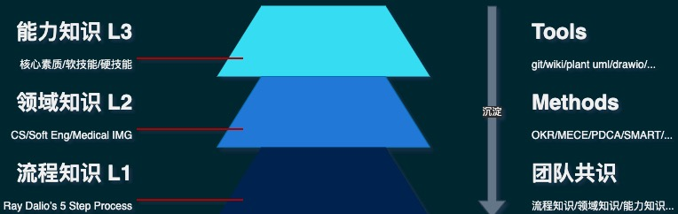
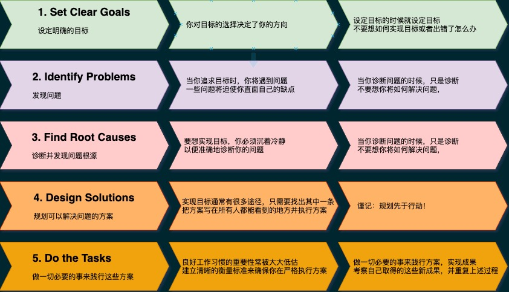
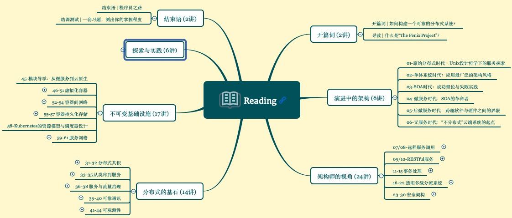

% 如何构建个人知识体系框架
% lyan
% 2021-05-28

## 每个人都该构建自己的知识管理体系

### 知识管理

- 知识管理(Knowledge management, KM)是对知识和信息的创造、共享、使用和管理的过程。它指的是通过充分利用知识来实现组织目标的多学科方法
- 知识管理是一门自1991年建立的学科
- 1999年，个人知识管理(personal knowledge management)这个术语被引入；它指的是个体层面的知识管理

### 知识体系对认知水平和学习效率的影响

- 连接新知识的能力
- 解决问题的通用步骤
  - 确定问题类型
  - 明确解决步骤
  - 确定工具和方法

### 知识体系的评价标准

- 整体性：服务于一个根本目标
- 适应性：支持解决遇到的问题

## 个人知识管理的系统框架

### 个人知识管理体系分层

### 工作流程(Level 1)

- 流程是知识体系基础框架，无流程不专业
- [Ray Dalio’s 5 Step Process](https://www.shortform.com/blog/principles-for-life/)
- 

### 业务领域的专业知识(Level 2)

- 熟练掌握构建工作流程知识体系后，成为一个称职的业务骨干
  - 掌握流程本身是可以持续优化的
- 构建专业领域知识体系帮你成为领域专家或资深人士
  - 要找到专业知识背后相通的本质规律
  - 按照本专业领域的主要原理和定律来组织知识

### 职业目标的能力知识(Level 3)

- 基于职业目标的能力知识体系，是个人层面上最完整的知识体系框架
  - 基于业务流程的知识体系(Level 1)
  - 基于业务领域的专业知识(Level 2)
  - 对人核心素质的要求，如：性格特征、优先习惯
  - 软技能：与专业无关的通用能力，如：思维能力、沟通能力等
  - 硬技能：围绕这个职位所需的专业技能

## 工作流程：流程知识体系

### 任务分类

- 产品开发：需要从优化需求分析、软件设计到TDD、工程交付的流程知识
- 外部合作项目：需要从目标的上下对齐、左右拉通到计划的3W3H等知识
- 内部优化项目：技术选型分析 / 优化方案设计 / Merge Request 等知识

### Done is Better than Perfect

- 完成目标，抓住最重要、最核心的点
- 按时交付

### 优化流程的方法：复盘

- PDCA
- 柳传志工作法，一件事情做三次
  - Preview（沙盘推演）：在做事之前把所有的可能性推演一遍，找出最佳方案
  - Do（执行）：具体的方案落地执行
  - Replay（复盘）：事后对做过的事情进行复盘

### 如何复盘

- 目标
  - 当初设定的目标是什么，设定目标的原因是什么
  - 在 Team 内部上下对齐、左右拉通了么
- 结果
  - 对照目标评估现在的工作成果，是完成了，没有完成，还是部分完成
- 分析：
  - 找到成功和失败的地方
  - 通过不停地追问，找到成功或失败的根本原因
- 总结
  - 继续深挖成功的经验或失败的教训
  - 输出优化后的流程、工具和方法

## 业务领域：专业知识框架

### 金字塔式知识体系

- 专业知识的价值
- 专业高度需要知识广度支持
  - 计算机科学：组成原理、操作系统 csapp/apue/unp
  - 软件开发：软件工程
  - 医疗行业：医学影像

::: notes

知识的收益往往是间接的，其本质是会缩减“投入成本”因素

- 减少试错成本
- 降低认知负荷（Cognitive Load）

:::

### 将思考具像化的十步学习法

- [十步学习法](https://slides.li3huo.com/10-step-system/)
  - Learn-Do-Learn-Teach
  - 驱动自己把思考的内容输出给他人

## 职业目标：能力知识体系

### 人生路和舒适圈

- 职业发展观
  - 行业趋势 + 公司阶段 + 团队
  - 做最有价值的事(从外向内看)
  - 制订高目标，在可能产出最多的地方投入
- 扩张自己的舒适圈
  - 享受发现的乐趣
    - 对爱的渴望，对知识的追求，对人类苦难不可遏制的同情，是支配我一生的单纯而强烈的三种情感 —— 伯兰特·罗素
  - 拓展自己的能力圈

### 程序员职业发展观

- 成为能用代码解决问题的程序员
- 也可以是团队协同创新的技术导师
  - 传播流程/专业知识，爱讲逻辑、爱讲道理
  - 追求更高的工作效率、更好的投入产出
- 创新者
  - 创造对别人有用的产品

::: notes

协同创新，技术导师

- 与一群最讲道理、最直来直往、最不需要琢磨小心思的程序员协同工作，管理不需要耗费太多的精力
- 传播流程/专业知识，爱讲逻辑、爱讲道理

:::

## 参考文献

### 1

- [Knowledge Management](http://wiki.li3huo.com/Knowledge_Management)

### 2

- [《学习力：颠覆职场学习的高效方法》](http://wiki.li3huo.com/book/Learning_Ability_by_WangShimin)

### 3

- [极客时间-公开课-周志明的软件架构课](http://wiki.li3huo.com/book/geekbang_OC_Software_Architecture_Class_ZhouZhiming)

### 4

- [复盘](http://wiki.li3huo.com/Replay)
  - [PDCA]((http://wiki.li3huo.com/PDCA))
  - [柳传志复盘工作法](https://mp.weixin.qq.com/s/lWl1W_8Anhy5NS9PKeZyHA)
    - 一件事做三次
      - Preview（沙盘推演）：在做事之前把所有的可能性推演一遍，找出最佳方案
      - Do（执行）：具体的方案落地执行
      - Replay（复盘）：事后对做过的事情进行复盘
    - 复盘的步骤
      - 目标/结果/分析/总结

### Principles: Life and Work by Ray Dalio

- [原则](http://wiki.li3huo.com/book/Principles_Life_and_Work)
  - 五步流程法
    - 树立目标；
    - 发现问题；
    - 诊断并发现问题根源；
    - 设计改进方案并解决问题；
    - 完成任务

### Revision History

- 2021-03-14 init version
- 2021-05-28 补充专业知识相关内容
