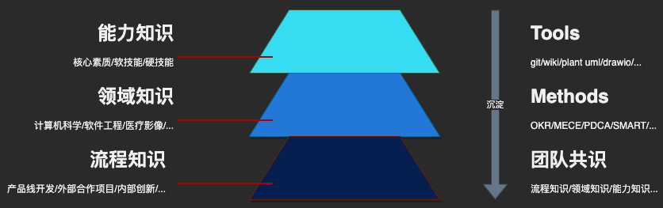
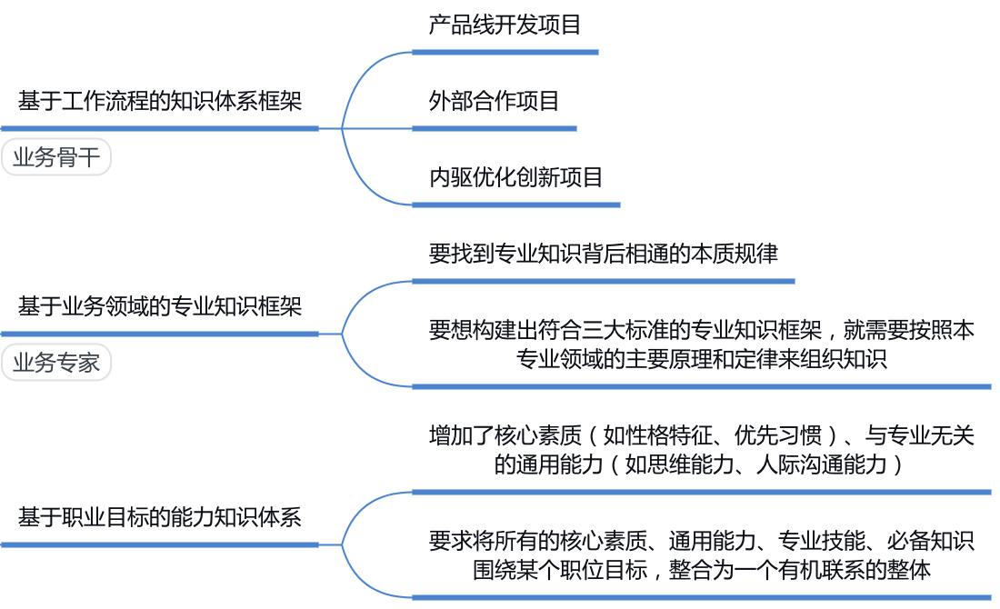

% 个人知识体系框架
% lyan
% 2021-03-14

## 每个人都该构建自己的知识管理体系

### 知识管理

- 知识管理(Knowledge management, KM)是对知识和信息的创造、共享、使用和管理的过程。它指的是通过充分利用知识来实现组织目标的多学科方法
- 知识管理是一门自1991年建立的学科
- 1999年，个人知识管理(personal knowledge management)这个术语被引入；它指的是个体层面的知识管理

### 知识体系对认知水平和学习效率的影响

- 连接新知识的能力
- 解决问题的通用步骤
  - 确定问题类型
  - 明确解决步骤
  - 确定工具和方法

### 知识体系的评价标准

- 整体性：服务于一个根本目标
- 适应性：支持解决遇到的问题

## 个人知识管理系统的框架

### 个人知识管理体系分层

### 工作流程的知识体系(Level 1)

- 基于流程的知识体系框架是最低层次的一种知识体系框架，是另外两种知识体系框架的重要基础
- 场景
  - 影像科后端开发负责人：从需求分析、软件设计到TDD、工程交付等等工作流程
  - 外部合作项目 VT 的后端工程师：从目标的上下对齐、左右拉通到计划的3W3H等方法
  - 组件优化项目的后端工程师：Merge Request 的工作方法等等

### 业务领域的专业知识(Level 2)

- 熟练掌握构建工作流程知识体系后，成为一个称职的业务骨干
  - 掌握流程本身是可以持续优化的
- 构建专业领域知识体系帮你成为领域专家或资深人士
  - 要找到专业知识背后相通的本质规律
  - 按照本专业领域的主要原理和定律来组织知识

### 职业目标的能力知识

- 基于职业目标的能力知识体系，是个人层面上最完整的知识体系框架
  - 基于业务流程的知识体系(Level 1)
  - 基于业务领域的专业知识(Level 2)
  - 对人核心素质的要求，如：性格特征、优先习惯
  - 软技能：与专业无关的通用能力，如：思维能力、沟通能力等
  - 硬技能：围绕这个职位所需的专业技能

## 优化工作流程的方法

### 坚持复盘

- 柳传志工作法，一件事情做三次
  - Preview（沙盘推演）：在做事之前把所有的可能性推演一遍，找出最佳方案
  - Do（执行）：具体的方案落地执行
  - Replay（复盘）：事后对做过的事情进行复盘

### 如何复盘

- 目标
  - 当初设定的目标是什么，设定目标的原因是什么
  - 在 Team 内部上下对齐、左右拉通了么
- 结果
  - 对照目标评估现在的工作成果，是完成了，没有完成，还是部分完成
- 分析：
  - 找到成功和失败的地方
  - 通过不停地追问，找到成功或失败的根本原因
- 总结
  - 继续深挖成功的经验或失败的教训
  - 输出优化后的流程、工具和方法

## 构建专业岗位所需技能知识的要点

## 参考文献

### 1

- [Knowledge Management](http://wiki.li3huo.com/Knowledge_Management)

### 2

- [《学习力：颠覆职场学习的高效方法》](http://wiki.li3huo.com/book/Learning_Ability_by_WangShimin) by 王世民 / 缪志聪

### 3

- [复盘](http://wiki.li3huo.com/Replay)
  - [PDCA]((http://wiki.li3huo.com/PDCA))
  - [柳传志复盘工作法](https://mp.weixin.qq.com/s/lWl1W_8Anhy5NS9PKeZyHA)
    - 一件事做三次
      - Preview（沙盘推演）：在做事之前把所有的可能性推演一遍，找出最佳方案
      - Do（执行）：具体的方案落地执行
      - Replay（复盘）：事后对做过的事情进行复盘
    - 复盘的步骤
      - 目标/结果/分析/总结

### Principles: Life and Work by Ray Dalio

- [原则](http://wiki.li3huo.com/book/Principles_Life_and_Work)
  - 五步流程法
    - 树立目标；
    - 发现问题；
    - 诊断并发现问题根源；
    - 设计改进方案并解决问题；
    - 完成任务
